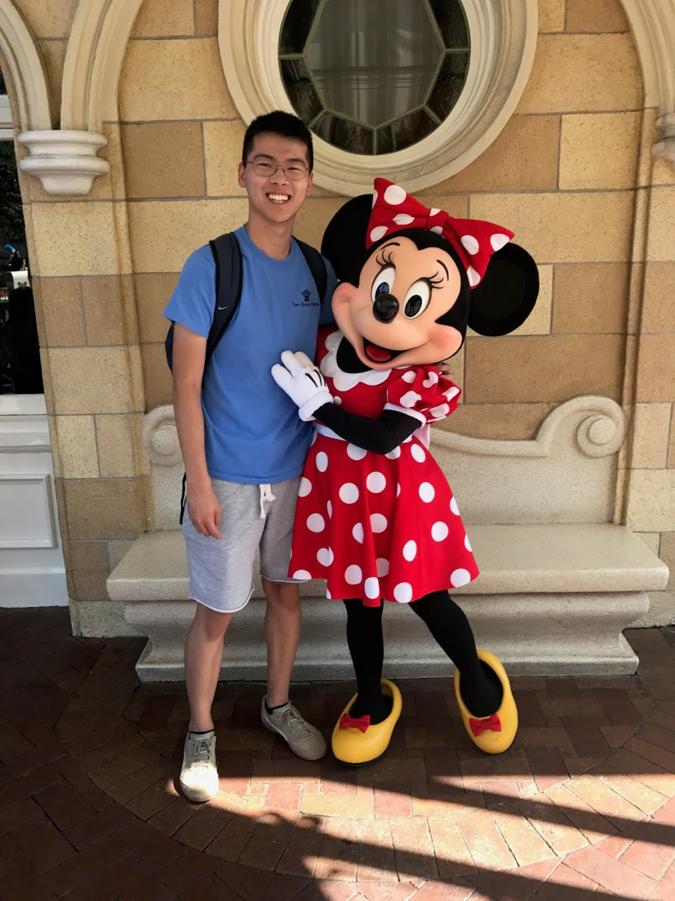

<!-- ## {{ page.title }} -->

<!--  -->

# Education

#### UC Berkeley 2020
BA Computer Science and Math

Here are some courses I have taken or am currently taking.

- Data Structures
- Discrete Math
- Probability Theory
- Algorithms
- Artificial Intelligence
- Computer Architecture

# Work Experience

#### Bloomberg LP
Software Engineering Intern, Summer 2017

#### UC Berkeley EECS Department
Undergradate Student Instructor, EE16A

#### A-Star Computer Science Camp
Instructor

<!-- I also teach Discrete Math and Probability Theory through [Computer Science Mentors](https://csmberkeley.github.io). -->

